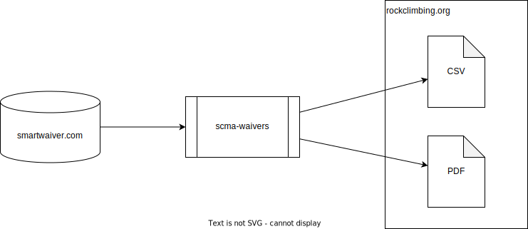

# SCMA Waivers

Automation that downloads waivers from Smartwaiver, generates CSV and PDF reports, and uploads them to the SCMA website.



## Run

Set the following environment variables:

* `SMARTWAIVER_API_KEY`
* `SCMA_FTP_USERNAME`
* `SCMA_FTP_PASSWORD`
* `SCMA_PAPER_WAIVERS_SHEET_ID`
* `GOOGLE_ACCOUNT_TYPE`
* `GOOGLE_CLIENT_ID`
* `GOOGLE_CLIENT_EMAIL`
* `GOOGLE_PRIVATE_KEY`

Then run:

```sh
bundle install --path vendor/bundle
bundle exec rake upload
```

## References

* https://api.smartwaiver.com/api/docs?bash#search

## License

The gem is available as open source under the terms of the [MIT License](https://opensource.org/licenses/MIT).
